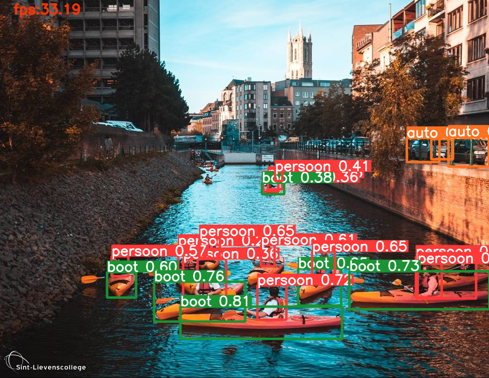

# AI in de Klas - Objectclassificatie v2 met YOLOv6
## Introductie

Tijdens eerdere projecten maakten leerlingen en cursisten kennis met supervised learning (Machine Learning) en hoe je het kan toepassen om aan objectclassificatie te doen. 
We maakten met bovenstaande aanpak reeds een [Slimme Vuilnisbak](https://www.robbewulgaert.be/onderwijs/bouw-een-slimme-vuilnisbak) en [eigen projecten](https://www.robbewulgaert.be/onderwijs/1-jaar-ai-in-de-klas). 

Bovenstaande aanpak is uitstekend voor een inleiding in objectclassificatie door te werken met bv. een Teachable Machine. Deze aanpak kent echter ook beperkingen, omdat het slechts één klasse per keer detecteert / aantoont. 
Die aanpak kan dus moeilijkn overweg met meer gecompliceerde scenes zoals een drukke straat, een koelkast met meerdere items ... Door gebruik te maken van een YOLO-framewerk kunnen we deze beperking oplossen. 
YOLOv6 is een éénfasig framework voor objectdetectie, speciaal voor industriële toepassingen, met een hardware-vriendelijk efficiënt ontwerp en hoge prestaties.

Deze aanpak is gebaseerd op aangepaste code van [Meituan YOLOv6](https://github.com/meituan/YOLOv6). Ook de COCO-dataset werd aangepast voor gebruik in het Nederlandstalig onderwijs. 

## Waar wordt nog aan gewerkt?

- [ ] Lesmateriaal zoals boekjes, slides ... 
- [ ] Eindresultaten uit de klaspraktijk ... 
- [ ] Beter gestructureerde Colab Notebook. 

## Hoe gebruiken? 

Dit materiaal behoort tot de lessenreeks 'Objectclassificatie v2 met YOLOv6' op het Sint-Lievenscollege Gent. 
Met dit lesmateriaal is het mogelijk aan objectdetectie te doen met de standaard COCO-dataset, of met een zelfgemaakte dataset. 
Objectdetectie is mogelijk op drie bronnen, namelijk: 

- [ ] een afbeelding
- [ ] een video
- [ ] de webcam-feed

Afbeeldingen en video's kunnen ingeladen worden via de GitHub of vanaf de computer van de leerling. Hierbij kan ook geteld worden hoeveel objecten uit elke klasse uit de dataset er werd gedetecteerd. 
Bij de webcam kan live objectdetectie worden toegepast, zonder teller-functie. 

## Credits

Voor vragen over deze lessenreeks kan je terecht bij jouw leerkracht over mailen naar: robbe.wulgaert@sintlievenscollege.be 

Bedacht en uitgewerkt met educatief doeleinde door Robbe Wulgaert, [Sint-Lievenscollege Gent](https://www.sintlievenscollege.be). 

[robbewulgaert.be ](https://www.robbewulgaert.be)

[AI in de Klas ](https://www.aiindeklas.be)
